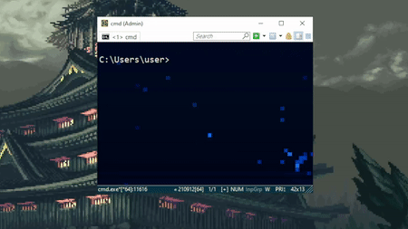

# cal
Cmd calendar like in Linux for Windows

# Requirements

 - Pytz
 - Datetime
 - calendar
 - [colorama](https://pypi.org/project/colorama/)

# Example

# How to use

To quickly call the program, you should add it to the Windows environment variables.

Add the full path to the directory with the program to the PATH variable
